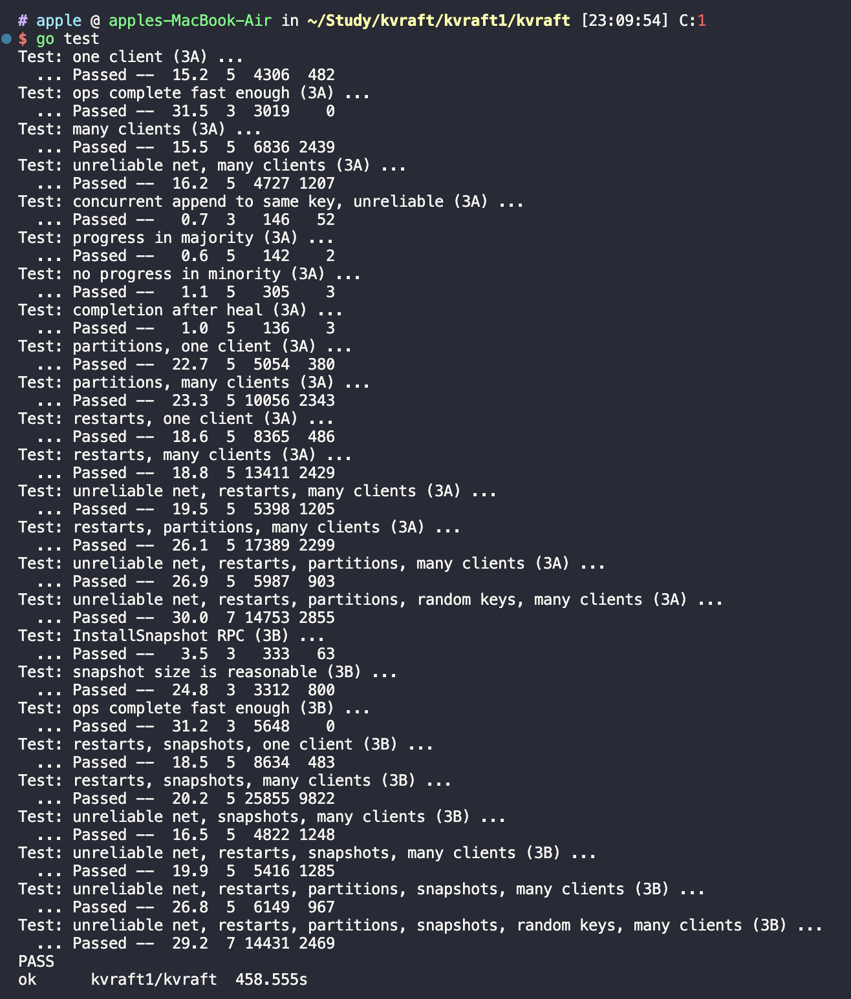

# 简介
在之前 [Raft 库](https://github.com/1055373165/MIT-8.624)实现的基础上，实现了分布式键值存储，提供 Get、Put、Append 操作接口。
提供了如下能力：
- 保证非 Get 请求幂等性，已经执行过的 Put 或者 Append 请求不会重复执行，而是从缓存中直接获取执行结果；（通过 clientId 和 SequenceId 保证唯一性）；
- 所有待 apply 的消息都由一个单独的通道负责处理（参考 hashcorp future 结构体），并附带了请求超时处理（放在同一个 for select 中），在处理完成后异步删除无用的通道（防止阻塞主分支流程）；
- 保证已经处理过的请求不会被重复处理（ KVServer 维护一个已经应用的索引）；
- 崩溃恢复时无需读取 Raft 全量数据，而是从 snapshot 中快速恢复，同时支持进行 snapshot 的阈值设置。

# 代码结构
```
.
├── README.md
├── go.mod
├── kvraft
│   ├── client.go
│   ├── common.go
│   ├── config.go
│   ├── server.go
│   ├── state_machine.go
│   └── test_test.go
├── labgob
│   ├── labgob.go
│   └── test_test.go
├── labrpc
│   ├── labrpc.go
│   └── test_test.go
├── models
│   └── kv.go
├── porcupine
│   ├── bitset.go
│   ├── checker.go
│   ├── model.go
│   ├── porcupine.go
│   └── visualization.go
├── raft
│   ├── README.md
│   ├── config.go
│   ├── persister.go
│   ├── raft.go
│   ├── raft_application.go
│   ├── raft_compaction.go
│   ├── raft_election.go
│   ├── raft_log.go
│   ├── raft_persistence.go
│   ├── raft_replication.go
│   ├── test_test.go
│   └── util.go
└── resources
```

# 代码正确性测试

执行：`go test`

测试结果：


